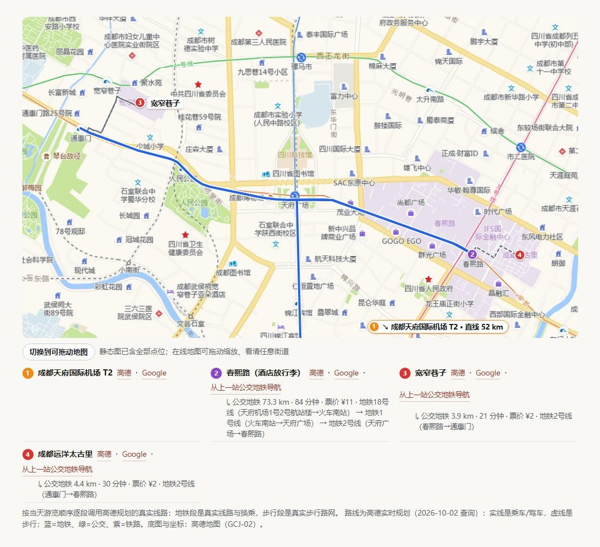
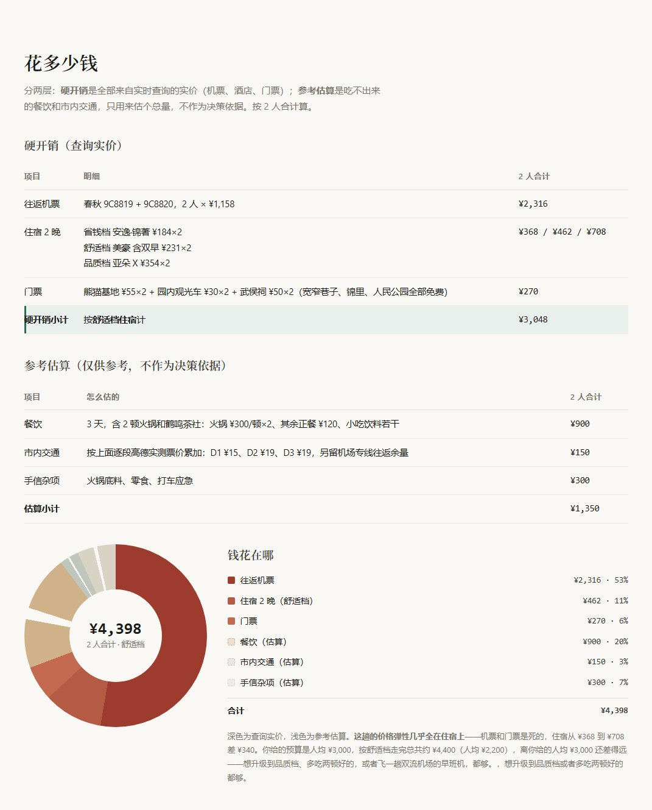
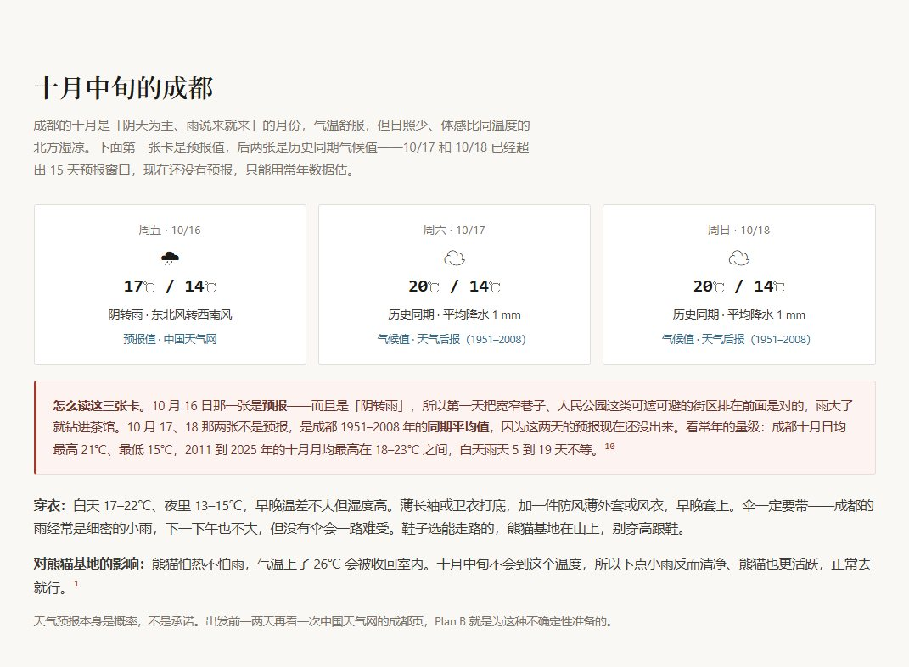

<p align="right">
  <a href="./README.md">简体中文</a> · <strong>English</strong>
</p>

<p align="center">
  
</p>

<p align="center">
  <a href="https://github.com/deepseek-ai/deepseek-harness"></a>
  <a href="./package.json"></a>
  
  <a href="https://github.com/AusertDream/TravelPlanner/actions/workflows/check.yml"></a>
  <a href="./LICENSE"></a>
</p>

## What it is

**TravelPlanner** (旅行规划师) is a Chinese-language trip-planning agent preset for [DeepSeek Harness (DSH)](https://github.com/deepseek-ai/deepseek-harness), built for trips within mainland China.

Tell it "3 days in Chengdu from Shanghai over the National Day holiday, 2 people, ¥6,000". It queries **live** data — 12306 train availability, flight and hotel prices from Fliggy and Tuniu, real transit routes from Amap — checks closing days, ticket-release windows and the weather, then hands you **a single HTML file that works offline**: a day-by-day timeline, draggable maps with real routes, three hotel price tiers, an itemized budget and navigation links for every stop.

> [!IMPORTANT]
> It plans and looks things up. It **never books or pays** for anything. Every price is a reference price at query time.

<p align="center">
  
</p>

## Why not just ask a chatbot

| | Plain chat | TravelPlanner |
|---|---|---|
| **Trains, fares, room rates** | From memory, often stale or invented | Queried live from 12306 / Fliggy / Tuniu, with source and query date |
| **Getting around** | "About 30 minutes by metro" | Real Amap routes: which lines, transfers, minutes, fare |
| **Closures, reservations, last trains** | Often missed | Hard constraints first (closing days, ticket release, ID-capped entry, last cable car), then the itinerary |
| **Where to stay** | A vague district | Chosen by where your days actually go; three tiers, always including whole rooms under ¥200 and under ¥400, with room photos |
| **Deliverable** | A wall of chat text | One HTML file: images inlined, mobile-friendly, works offline |
| **Quality check** | You find the bugs | A delivery gate: static checks, layout checks at desktop and phone widths, and a screenshot review |

## Gallery

<table>
  <tr>
    <td width="50%" align="center"><br><sub><b>Opening</b>: why the trip is laid out this way</sub></td>
    <td width="50%" align="center"><br><sub><b>Daily timeline</b>: when, where, how and how much, plus a Plan B</sub></td>
  </tr>
  <tr>
    <td width="50%" align="center"><br><sub><b>Budget</b>: itemized, with a donut chart</sub></td>
    <td width="50%" align="center"><br><sub><b>Weather</b>: forecast for the trip dates, with packing and rescheduling advice</sub></td>
  </tr>
</table>

Full example: [`examples/成都3天2晚路书.html`](examples/成都3天2晚路书.html) (download and open in a browser).

## Quick start

**Prerequisites**: Node.js ≥ 22, Python 3, Git, Chrome or Edge. The data-source CLIs (Fliggy, Amap, Tuniu) can wait: on its first run the agent tells you what is missing and can install it for you if you agree.

### Option 1: DSH desktop "Add plugin" (recommended)

1. Sidebar **Plugins → Add plugin**, paste the repository URL and click Install:

   ```text
   https://github.com/AusertDream/TravelPlanner
   ```

2. **Quit DSH completely and reopen it** (right-click the tray icon → Quit; closing the window is not enough). On first start the plugin copies its tool scripts and skills into `~/.dsh`.
3. Start a new session, pick the **旅行规划师** mode and describe your trip.

### Option 2: the plugin market

Once it is listed on [awesome-dsh-plugin](https://github.com/awesome-dsh-plugin/awesome-dsh-plugin), you can search for "TravelPlanner" in the [dsh-market](https://github.com/dsh-market/dsh-market) plugin market (Settings → Plugin Market) and install it in one click. Restart DSH afterwards.

### Option 3: clone and run the installer

```bash
npm install -g @fly-ai/flyai-cli @amap-lbs/amap-gui tuniu-cli
python -m pip install pillow

git clone https://github.com/AusertDream/TravelPlanner.git
cd TravelPlanner
node scripts/install.mjs
```

The installer sets up the tool scripts, the skills and the 12306 MCP server, registers the repository as a DSH bundle, and finishes with an environment check. Options, upgrades, uninstalling and troubleshooting: [docs/INSTALL.md](docs/INSTALL.md) (Chinese).

## API keys

All keys live in one file, `~/.dsh/preset-assets/travel-planner/.env`, created on first install. Every key is free to apply for; step-by-step guide in [docs/KEYS.md](docs/KEYS.md) (Chinese).

| Key | | For | Without it |
|---|---|---|---|
| `AMAP_KEY` + `AMAP_SECURITY_KEY` | **Required** | Amap POIs, in-city routes, real routes on the map | No coordinates or in-city transit |
| `FLYAI_API_KEY` | **Required** | Live Fliggy flight, hotel and ticket prices | "Trial mode": hotel prices are masked |
| `GOOGLE_MAPS_API_KEY` | Optional | Interactive Google Maps inside the roadbook | Falls back to keyless embed / Amap tiles / static image |
| `UNSPLASH_ACCESS_KEY` | Optional | Photos | Falls back to Wikimedia (no key) |
| `TUNIU_API_KEY` | Optional | Tuniu as a second source | Usually not needed; use `tuniu auth login` instead |

Changes take effect as soon as you save; no restart needed. Check anytime with:

```bash
node ~/.dsh/preset-assets/travel-planner/doctor.mjs
```

## The skills work on their own

The planning method, transport, hotels, maps and roadbook rules are standalone skills in the standard `SKILL.md` format. Install them for other DSH agents, or for Claude Code and other agents that read skills:

```bash
node scripts/install.mjs --skills-only                                # all DSH agents (~/.dsh/skills)
node scripts/install.mjs --skills-only --skills-dir ~/.agents/skills  # shared agents directory
node scripts/install.mjs --skills-only --skills-dir ~/.claude/skills  # Claude Code
```

| Skill | Covers |
|---|---|
| `travel-planning` | **Orchestrator**: principles, intake, itinerary skeleton, day planning, self-review; tells the agent which module to load at each step |
| `travel-constraints` | Hard constraints: closing days, reservations, capped entry, timed tickets, last departures, weather windows, altitude |
| `travel-transport` | Plane vs. train by door-to-door time; every in-city leg |
| `travel-hotels` | Location, three price tiers, room photos |
| `travel-maps` | The `map-widget.py` component, real Amap routes |
| `travel-roadbook` | Page skeleton, sourcing, charts, the delivery gate |
| `train-booking` · `flyai-cli` · `amap-cli-skill` | How to use 12306 / Fliggy / Amap, and the pitfalls found in testing |

## Ground rules

- **No booking or payment**, no submitting ID details, no confirming prices on your behalf.
- **No made-up data**: times, prices and opening hours come from live queries and cite their source.
- **No scraping Xiaohongshu**: paste the note text or a screenshot instead.
- **Keys live only in `.env`**. The one exception is the Google Maps key, which is embedded in the roadbook HTML because the browser needs it; restrict it as described in [docs/KEYS.md](docs/KEYS.md).

## Compatibility

| | Status |
|---|---|
| DeepSeek Harness | `0.2.0-rc.2` desktop, tested |
| OS | Tested on Windows; macOS / Linux paths are handled but not tested end to end |
| Runtime | Node.js ≥ 22, Python 3 + Pillow, Chrome or Edge |
| Destinations | Mainland China first; all times in Beijing time |

## License

[MIT](LICENSE) © Tianyi Jiang. Third-party components and services: [NOTICE.md](NOTICE.md).
