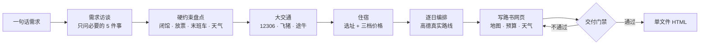

<p align="right">
  <strong>简体中文</strong> · <a href="./README.en.md">English</a>
</p>

<p align="center">
  
</p>

<p align="center">
  <a href="https://github.com/deepseek-ai/deepseek-harness"></a>
  <a href="./package.json"></a>
  
  <a href="https://github.com/AusertDream/TravelPlanner/actions/workflows/check.yml"></a>
  <a href="./LICENSE"></a>
  <a href="https://github.com/AusertDream/TravelPlanner/stargazers"></a>
</p>

<p align="center">
  <a href="#-快速开始">快速开始</a> ·
  <a href="#️-效果预览">效果预览</a> ·
  <a href="#-需要哪些-key">需要哪些 Key</a> ·
  <a href="#-技能也能单独用">技能单独用</a> ·
  <a href="docs/INSTALL.md">安装指南</a> ·
  <a href="#-常见问题">常见问题</a>
</p>

## 一句话需求，交付一份能用的路书

**旅行规划助手**是跑在 [DeepSeek Harness（DSH）](https://github.com/deepseek-ai/deepseek-harness) 里的中文旅行规划 agent，帮你把一趟旅行从头到尾排明白。

你说「国庆从上海去成都玩 3 天，2 个人，预算 6000」。它会**当场查** 12306 余票、飞猪 / 途牛的机票和酒店价、高德的真实路线，核实闭馆日、预约放票和天气，最后交给你**一个能离线打开的 HTML 文件**：逐日时间轴、可拖动地图、三档酒店、分项预算、每一站的导航链接都在里面，转发给同行的人直接就能看。

> [!IMPORTANT]
> 它只做规划和查询，**绝不代订、代付**。所有价格都是查询时的参考价，预订由你自己在官方渠道完成。

<p align="center">
  
</p>

## 🆚 和「问一句 AI 给个攻略」有什么不同

| | 普通对话 | 旅行规划助手 |
|---|---|---|
| **车次、票价、房价** | 凭记忆，常常过时或编造 | 当场查 12306 / 飞猪 / 途牛，标注来源和查询日期 |
| **市内怎么走** | 「坐地铁大概 30 分钟」 | 高德真实路线：几号线换几号线、几分钟、票价几块 |
| **闭馆、预约、末班车** | 经常漏 | 先盘硬约束（闭馆日、放票时间、实名限量、末班缆车），再排行程 |
| **住哪** | 一个笼统的区域 | 按动线重心选址，三档价格（必有 < ¥200 和 < ¥400 的整间房），附房型实拍 |
| **交付** | 一大段聊天文字 | 一个 HTML 文件：图片内联、手机也能看、离线可用 |
| **出错了怎么办** | 你自己发现 | 交付前自动跑门禁：静态检查、桌面 + 手机两种宽度的布局检查、首屏截图自检 |

## 🖼️ 效果预览

<table>
  <tr>
    <td width="50%" align="center"><br><sub><b>首屏</b>：这趟为什么这么排，一段话讲清取舍</sub></td>
    <td width="50%" align="center"><br><sub><b>逐日时间轴</b>：几点到哪、怎么去、花多少，附 Plan B</sub></td>
  </tr>
  <tr>
    <td width="50%" align="center"><br><sub><b>花多少钱</b>：分项预算 + 环形图，每一项可追溯</sub></td>
    <td width="50%" align="center"><br><sub><b>天气</b>：出行那几天的预报与穿衣、改期建议</sub></td>
  </tr>
</table>

完整示例：[👉 在线看成都 3 天 2 晚路书](https://ausertdream.github.io/TravelPlanner/examples/%E6%88%90%E9%83%BD3%E5%A4%A92%E6%99%9A%E8%B7%AF%E4%B9%A6.html)（手机也能开，在线版地图是静态图）。源文件在 [`examples/成都3天2晚路书.html`](examples/成都3天2晚路书.html)，下载下来离线也能看。

## 🧭 它是怎么规划的



每一步对应一个技能模块，按需加载，不会一次把所有规则塞进上下文。开工前它还会先跑一遍**环境自检**：缺了必需的 Key 会停下来告诉你去哪申请、填到哪；只是没配可选的 Google Maps Key，就不打断你。

## 🚀 快速开始

**前提**：Node.js ≥ 22、Python 3、Git、Chrome 或 Edge。数据源 CLI（飞猪 / 高德 / 途牛）可以先不装，agent 第一次开工时会告诉你缺什么，你同意的话它能帮你装。

### 方式一：DSH 桌面版「添加插件」（推荐）

1. 侧栏 **插件 → 添加插件**，粘贴仓库地址，点「安装」：

   ```text
   https://github.com/AusertDream/TravelPlanner
   ```

2. **完全退出 DSH 再打开**（托盘图标右键退出；只关窗口不算）。第一次启动时，插件会自动把工具脚本和技能装到 `~/.dsh` 下。
3. 新建会话，模式选「**旅行规划助手**」，说一句你想去哪玩。

> 桌面版的插件目前不能自动更新：升级时先在插件管理里卸载，再按上面的步骤装新版。

### 方式二：插件市场

收录进 [awesome-dsh-plugin](https://github.com/awesome-dsh-plugin/awesome-dsh-plugin) 精选列表后，就能在 [dsh-market](https://github.com/dsh-market/dsh-market) 插件市场（设置 → 插件市场）里搜「TravelPlanner」一键安装，装完同样要完全退出并重开 DSH。

### 方式三：克隆仓库 + 安装脚本（一次装齐）

```bash
npm install -g @fly-ai/flyai-cli @amap-lbs/amap-gui tuniu-cli   # 飞猪 / 高德 / 途牛 CLI
python -m pip install pillow

git clone https://github.com/AusertDream/TravelPlanner.git
cd TravelPlanner
node scripts/install.mjs
```

脚本会装好工具脚本、技能和 12306 MCP，把仓库注册成 DSH 的 bundle，最后跑一遍环境自检。选项、升级、卸载、排障见 **[docs/INSTALL.md](docs/INSTALL.md)**。

## 🔑 需要哪些 Key

都在一个文件里：`~/.dsh/preset-assets/travel-planner/.env`（首次安装时自动生成）。申请都免费，图文步骤见 **[docs/KEYS.md](docs/KEYS.md)**。

| Key | | 管什么 | 没有会怎样 |
|---|---|---|---|
| `AMAP_KEY` + `AMAP_SECURITY_KEY` | **必需** | 高德 POI、市内路线、地图上的真实路线 | 查不了景点坐标和市内交通 |
| `FLYAI_API_KEY` | **必需** | 飞猪机票、酒店、门票实时价 | 进「体验模式」，酒店价格被遮蔽 |
| `GOOGLE_MAPS_API_KEY` | 可选增强 | 路书里直接加载可拖动的 Google 地图 | 自动降级到无 Key 嵌入 / 高德瓦片地图 / 静态图 |
| `UNSPLASH_ACCESS_KEY` | 可选 | 路书配图 | 改用 Wikimedia（免 Key） |
| `TUNIU_API_KEY` | 可选 | 途牛（第二数据源） | 一般走 `tuniu auth login` 网页授权，不用填 |

填完保存即生效，不用重启 DSH。随时可以手动自检：

```bash
node ~/.dsh/preset-assets/travel-planner/doctor.mjs
```

## 🧩 技能也能单独用

规划方法论、交通、住宿、地图、路书都写成了独立的技能（标准 `SKILL.md` 格式），可以单独装给 DSH 里的其他 agent，或 Claude Code 等支持技能的 agent：

```bash
node scripts/install.mjs --skills-only                                # DSH 所有 agent（~/.dsh/skills）
node scripts/install.mjs --skills-only --skills-dir ~/.agents/skills  # 多种 agent 共用的目录
node scripts/install.mjs --skills-only --skills-dir ~/.claude/skills  # Claude Code
```

| 技能 | 内容 |
|---|---|
| `travel-planning` | **总控**：规划信条、需求访谈、行程骨架、逐日编排、自检；告诉 agent 每一步加载哪个模块 |
| `travel-constraints` | 硬约束：闭馆日、预约放票、实名限量、时段票、末班车、天气窗口、高原 |
| `travel-transport` | 大交通取舍（按门到门时间比较飞机和高铁）、市内每段怎么走 |
| `travel-hotels` | 选址、三档价格梯度、途牛低配额下怎么挑、房型实拍图 |
| `travel-maps` | 地图组件 `map-widget.py`、高德真实路线、出图尺寸 |
| `travel-roadbook` | 路书网页骨架、来源标注、天气与预算图表、交付门禁 |
| `train-booking` · `flyai-cli` · `amap-cli-skill` | 12306 / 飞猪 / 高德 的用法与实测踩过的坑 |

## 💬 怎么用

在「旅行规划助手」模式里像跟朋友聊天一样说就行：

- 「十一从杭州去西安 4 天，两个大人一个 6 岁小孩，预算一万，想看兵马俑」
- 「帮我看看这份行程有没有问题」+ 贴上行程文字或截图
- 「第二天太赶了，换个轻松点的」——它会改网页，并告诉你改了哪里

它只问必要的几件事：从哪出发（**绝不默认**）、日期、人数、预算、硬性要求。偏好和节奏先按常理假设，直接出方案让你改。一次完整规划大约 20–30 分钟，产出放在会话的工作目录里。

## 🛡️ 它会守的规矩

- **不代订代付**：不下单、不提交证件信息、不替你确认价格。
- **数据不编**：时刻、价格、开放时间都来自当次查询并标注来源；查不到就写「未查到，需自行核实」。
- **不爬小红书**：想参考某篇笔记，请把正文或截图发给它。
- **Key 只在 `.env` 一处**：技能、persona、脚本里都不写明文 Key。Google Maps Key 例外地会写进路书 HTML（浏览器要用），请按 [docs/KEYS.md](docs/KEYS.md) 设好 API 限制和配额。

## ❓ 常见问题

<details>
<summary><b>要花钱吗？</b></summary>

几个 Key 都可以免费申请，额度够个人用。Google Maps 需要绑定结算账号，但每月有免费额度，而且它是可选的。模型的 token 费用按你在 DSH 里用的模型照常计算。
</details>

<details>
<summary><b>没有 Google Maps Key，地图还能用吗？</b></summary>

能。地图组件按「Google 无 Key 嵌入 → 高德瓦片可拖动地图 → 静态图」自动降级，不会白屏。在国内网络下，高德瓦片反而更稳。
</details>

<details>
<summary><b>能规划国外的行程吗？</b></summary>

主要面向国内行程：12306、高德真实路线、飞猪 / 途牛的国内酒店都是它的强项。境外目的地也能规划（机票、天气、公开资料照查），但市内真实路线这类能力不覆盖。
</details>

<details>
<summary><b>路书能直接发给同行的人吗？</b></summary>

能。图片都内联在一个 HTML 文件里，对方用浏览器打开即可，手机也能看。如果配了 Google Maps Key，Key 会写进页面；不想带 Key 就让它生成地图时加 `--no-google-key`。
</details>

<details>
<summary><b>它说「当前为体验模式」/ 酒店价格是 ¥3xx 这种？</b></summary>

`FLYAI_API_KEY` 没填或填错了。跑一下 `doctor.mjs` 看看，填好后保存即生效。
</details>

<details>
<summary><b>模式列表里没有「旅行规划助手」？</b></summary>

多半是没有完全退出 DSH：桌面版要在托盘图标上右键「退出」，再重新打开。更多排障见 [docs/INSTALL.md](docs/INSTALL.md#排障)。
</details>

<details>
<summary><b>怎么卸载？</b></summary>

在 DSH 插件管理里移除 `dsh-travel-planner`，然后运行 `node scripts/install.mjs --uninstall` 清掉工具脚本和技能（会挪进 `~/.dsh/_trash/`，你的 `.env` 保留）。
</details>

## 🤝 兼容性

| | 状态 |
|---|---|
| DeepSeek Harness | `0.2.0-rc.2` 桌面版实测通过 |
| 系统 | Windows 实测；macOS / Linux 做了跨平台处理（浏览器路径、字体、进程清理），尚未完整跑过端到端 |
| 运行环境 | Node.js ≥ 22、Python 3 + Pillow、Chrome 或 Edge |
| 目的地 | 中国大陆为主；时间一律按北京时间 |

## 🗂️ 仓库结构

<details>
<summary>展开看看</summary>

```
TravelPlanner/
├── package.json          DSH bundle 清单（dsh.bundle.patch → preset/cordis.patch.yml）
├── preset/
│   ├── persona.txt       人格（唯一真相）
│   └── cordis.patch.yml  agent 的插件组合；persona 由 scripts/build-persona.mjs 写入
├── plugins/              DSH 插件：travel-env（读 .env、env_status / env_reload、首次启动自举）、travel-finance（汇率）
├── assets/               工具脚本 → ~/.dsh/preset-assets/travel-planner/
│   ├── doctor.mjs          环境自检
│   ├── run.sh              带 Key 执行 CLI（DSH 的 shell 拿不到 Host 注入的环境变量）
│   ├── map-widget.py       路书地图组件（静态底图 + 可拖动地图 + 真实路线 + 导航链接）
│   ├── amap-route.mjs      高德真实路线（无头浏览器里调 JSAPI）
│   ├── deliver-check.sh    交付门禁
│   └── …
├── skills/               技能 → ~/.dsh/skills/
├── vendor/12306-mcp/     12306 MCP 的上游版本号 + 预售期补丁
├── scripts/              install.mjs（安装 / 升级 / 卸载）、build-persona.mjs、check.mjs、lib/sync.mjs
├── examples/             示例路书
├── photos/               角色三视图
├── video-src/            宣传片构建源码与角色、背景图（成片在 video/，不入库）
└── docs/                 INSTALL · KEYS · DEVELOPMENT
```

改 agent、跑端到端测试、踩过的坑：见 [docs/DEVELOPMENT.md](docs/DEVELOPMENT.md)。
</details>

## 🐳 换上旅行装的 DeepSeek

<p align="center">
  
</p>

宣传片里带你出门的，是换上旅行装的 DeepSeek：草帽、胸前的相机、鲸鱼斜挎包，鲸尾巴也一起带上了。形象是大家口中「大肥鱼」的二创，三视图在 [photos/](photos/)，宣传片的构建源码和素材在 [video-src/](video-src/)。

## 📄 许可证与致谢

[MIT](LICENSE) © Tianyi Jiang

数据来自 12306、高德开放平台、飞猪旅行 AI 开放平台、途牛开放平台；12306 查询基于 [Joooook/12306-mcp](https://github.com/Joooook/12306-mcp)。第三方组件与在线服务的说明见 [NOTICE.md](NOTICE.md)。
